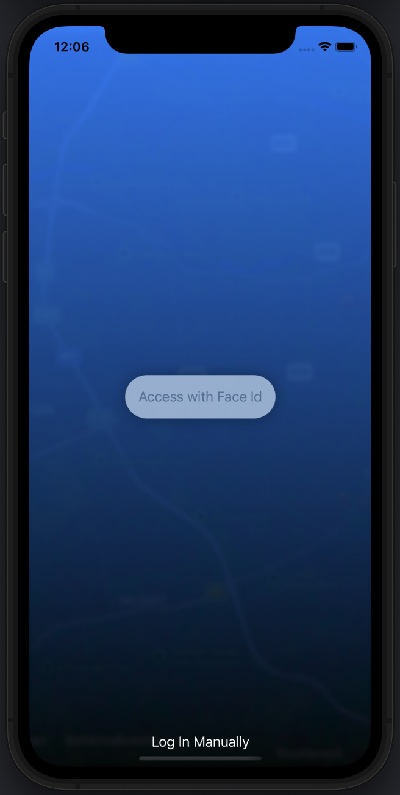
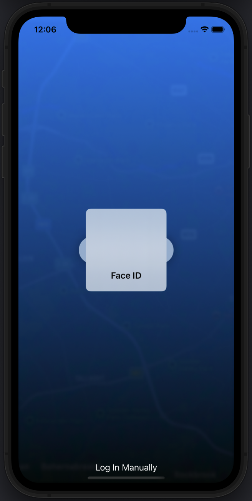
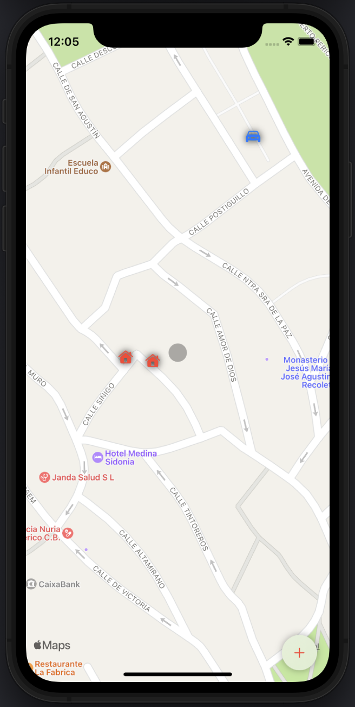
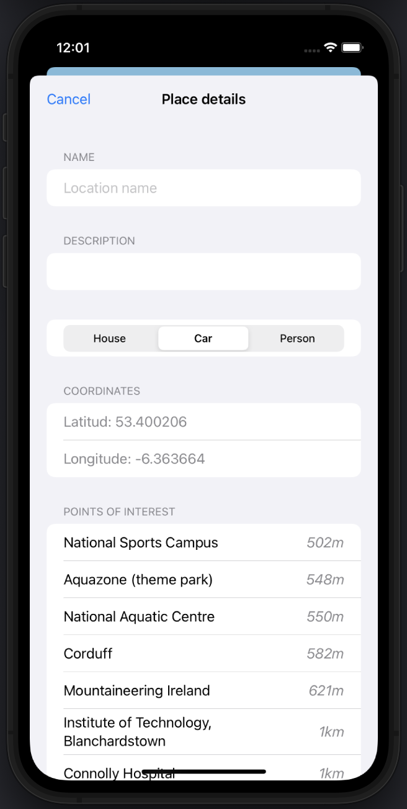

# BuckList

Hi there.

Today’s app is a little bit more complex than usual. I wanted to experiment with some new features such as Mapkit, biometric authentications, states to adapt the UI and writing and reading from files on the device, as a method to persist the information. The original project comes from the course 100 days of SwiftUI, and it is all about letting the user store some points of interest attaching information to them. At the same time, the app request from Wikipedia API data about relevant placer nearby.

Base on this, I made some modifications to offer the user the chance of select different types of icons, and to show the distance from our point to the other point of interests and to delete certain points. While doing this project, I thought that I could develop an app to organize police operations, storing the places where the most important crimes were committed, and distributing the patrols throughout the map.

###### Authenticate with Face Id

###### Main screen

###### Location view

